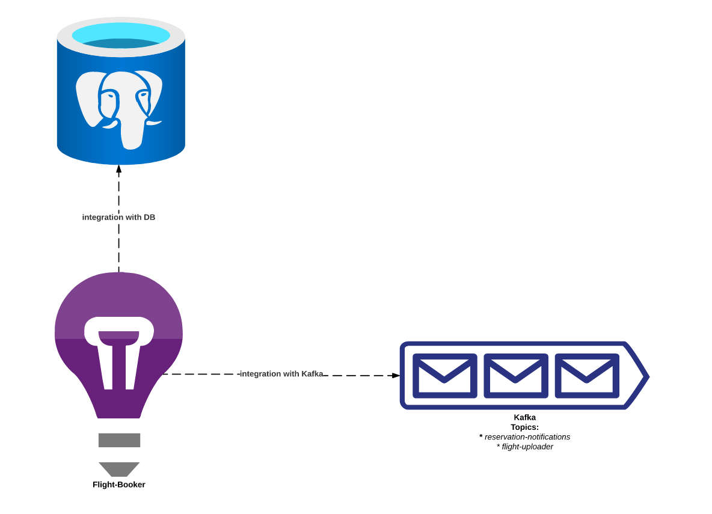
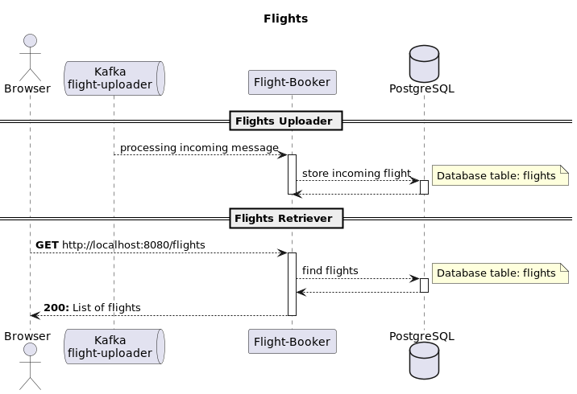
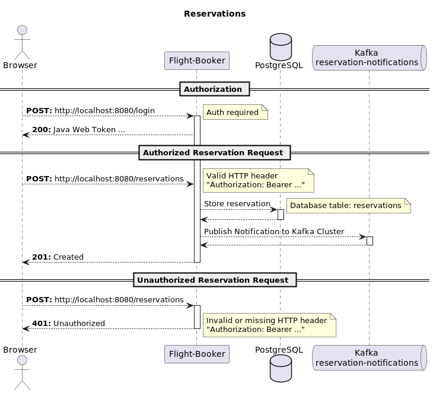

# Workshops ŁDI, 2022

## Contact:

mail: zielinskimaciej at yahoo.com

## Presentation:

https://prezi.com/i/xzhyrnr7hct9/

## How to build application:

**Note**

> Currently, tests requires up & running PostgreSQL and Kafka (docker compose files).
> It is shortcut for demo purposes, but in regular project we would start such components dynamically during tests
> executions (for example using TestContainers or database in memory)

`./gradle clean build`

## How to start environment:

### Kafka cluster

`docker-compose -f docker/kafka-stack.yml up -d`

#### URL for Topics

http://localhost:3030/kafka-topics-ui/

### Postgres database (schema is created by application)

`docker-compose -f docker/postgres-stack.yml up -d`

#### Db Adminer:

* URL: http://localhost:8081/
* Connection Host (docker host on linux): 172.17.0.1
* User: postgres
* Password: secret

#### Swagger-UI (when application is running):

* http://localhost:8080/swagger-ui#

## How to build and start native-image application:

### Build

`./gradlew dockerBuildNative`

### Start

`docker stack deploy -c docker/native-image.yml docker`

### Remove

`docker stack rm docker`

## Application Diagrams:

### Components

### Flights

### Reservations

## Micronaut 3.7.3 Documentation:

I recommend Micronaut documentation. It is brilliant.

- [User Guide](https://docs.micronaut.io/3.7.3/guide/index.html)
- [API Reference](https://docs.micronaut.io/3.7.3/api/index.html)
- [Configuration Reference](https://docs.micronaut.io/3.7.3/guide/configurationreference.html)
- [Micronaut Guides](https://guides.micronaut.io/index.html)
- [Deploy a Serverless Micronaut function to AWS Lambda Java 11 Runtime](https://guides.micronaut.io/latest/mn-serverless-function-aws-lambda-gradle-java.html)
